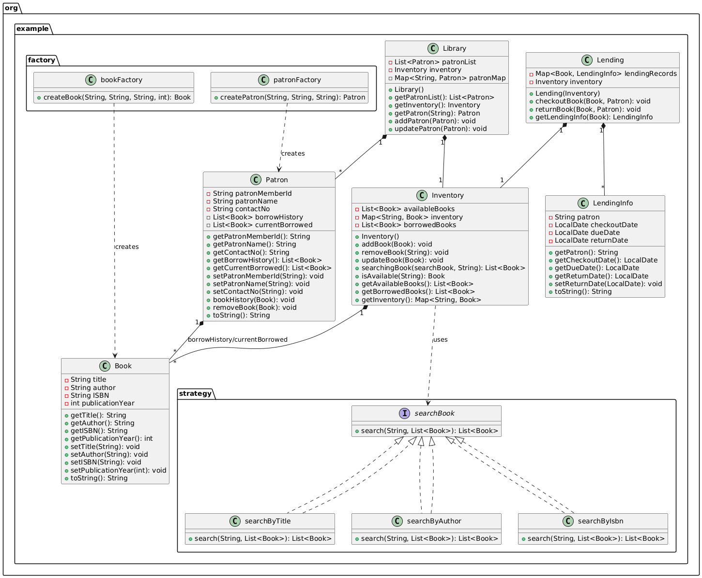

# Library-Management-System
A Library Management System to keep the track of the books.

## Overview

This Java-based Library Management System manages books, patrons, and lending operations. It demonstrates design patterns such as Factory and Strategy, and includes features like searching books by title, author, or ISBN, and tracking lending dates (checkout, due, and return) along with the patron who borrowed the book.

## Features

- **Book Management:** Add, update, and remove books in the inventory.
- **Patron Management:** Add and update patrons.
- **Lending Operations:** Checkout and return books with tracking of checkout date, due date, return date, and borrowing patron.
- **Search Functionality:** Search books by title, author, or ISBN using the strategy pattern.
- **Factories:** Use factory classes to create Book and Patron objects.
- **Inventory Management:** Track available and borrowed books.

## Project Structure

- `org.example.Book` — Represents a book entity.
- `org.example.Patron` — Represents a library patron.
- `org.example.Inventory` — Manages book inventory.
- `org.example.Lending` — Manages lending operations, tracks lending records with patron and dates.
- `org.example.Library` — Manages patrons and inventory.
- `org.example.factory.bookFactory` — Factory to create Book objects.
- `org.example.factory.patronFactory` — Factory to create Patron objects.
- `org.example.strategy.searchBook` — Interface for search strategies.
- `org.example.strategy.searchByTitle` — Search books by title.
- `org.example.strategy.searchByAuthor` — Search books by author.
- `org.example.strategy.searchByIsbn` — Search books by ISBN.
- `org.example.Main` — Main class demonstrating usage.

## How to Run

1. Compile all Java files under the `org.example` package.
2. Run the `Main` class.
3. The program demonstrates adding books and patrons, performing lending operations, searching books.

## Class Diagram
